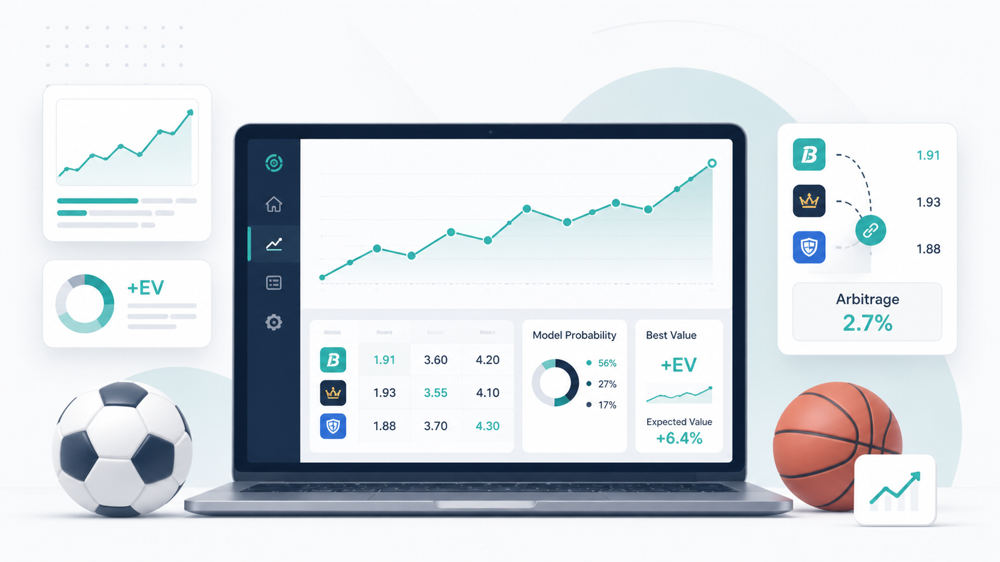
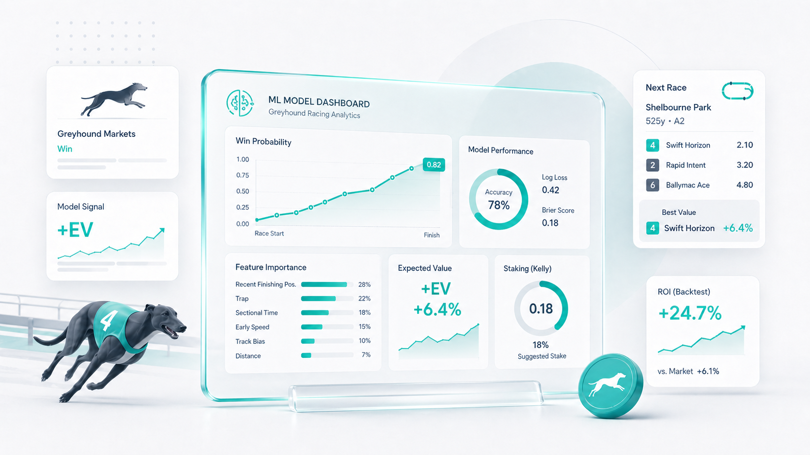
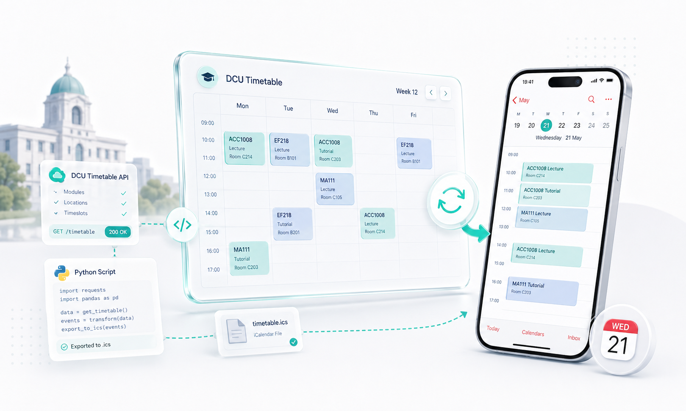
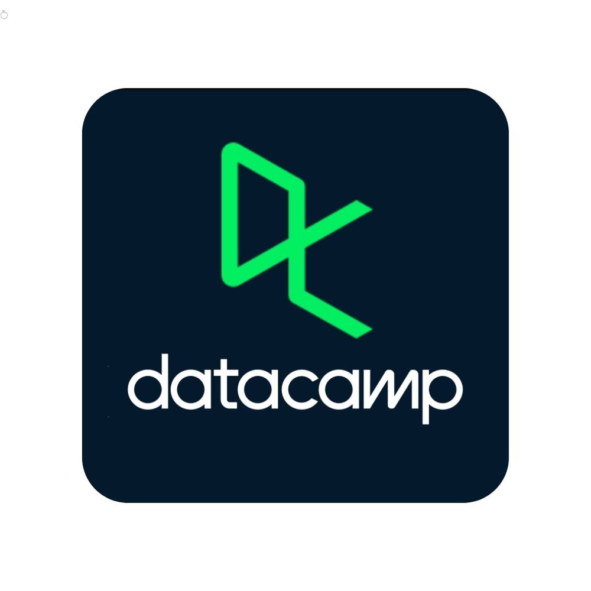

Explore some of my passion projects, as well as previous college assignments.

### Featured projects

```{=html}
<div class="landing-cards" role="list" style="grid-template-columns: 1fr; max-width: 56rem;">
  <a class="landing-card-link" href="sports-betting-analysis-project.html" role="listitem" aria-label="Open sports betting analysis project page">
    <article class="landing-card">
      
      <div class="landing-card__accent" aria-hidden="true"></div>
      <h3 class="landing-card__title">Sports Betting Analysis Project</h3>
      <p class="landing-card__text">Created a series of webscrapers to compile odds data from multiple sources to look for +EV and Arbitrage oppurtunities.</p>
    </article>
  </a>
  <a class="landing-card-link" href="project-2.html" role="listitem" aria-label="Open Project 2 page">
    <article class="landing-card">
      
      <div class="landing-card__accent" aria-hidden="true"></div>
      <h3 class="landing-card__title">Machine Learning Project</h3>
      <p class="landing-card__text">Tested whether a ML model in combination with smarter staking techniques could be used to determine a profitable betting strategy in greyhound win markets in Ireland.</p>
    </article>
  </a>
  <a class="landing-card-link" href="project-3.html" role="listitem" aria-label="Open Project 3 page">
    <article class="landing-card">
      
      <div class="landing-card__accent" aria-hidden="true"></div>
      <h3 class="landing-card__title">DCU timetable to apple calender</h3>
      <p class="landing-card__text">Created a simple python script to query DCU timetable API for selected modules and turn it into a suitable format for apple calender.</p>
    </article>
  </a>
</div>
```

### My Favourite Learning Resources

```{=html}
<div class="resource-entry">
  <div class="resource-tile">CS50 Python Playlist</div>
  <div class="resource-video-wrap">
    <iframe
      src="https://www.youtube.com/embed/OvKCESUCWII?list=PLhQjrBD2T3817j24-GogXmWqO5Q5vYy0V"
      title="YouTube playlist — CS50 Python"
      allow="accelerometer; autoplay; clipboard-write; encrypted-media; gyroscope; picture-in-picture; web-share"
      allowfullscreen>
    </iframe>
  </div>
  <p class="resource-desc">A playlist I followed some time ago to help me learn python.</p>
</div>

<div class="resource-entry">
  <div class="resource-tile">Machine Learning in Python Tutorials</div>
  <div class="resource-video-wrap">
    <iframe
      src="https://www.youtube.com/embed/ujTCoH21GlA?list=PLzMcBGfZo4-mP7qA9cagf68V06sko5otr"
      title="YouTube playlist — Python tutorials"
      allow="accelerometer; autoplay; clipboard-write; encrypted-media; gyroscope; picture-in-picture; web-share"
      allowfullscreen>
    </iframe>
  </div>
  <p class="resource-desc">A playlist that helped me learn how to use machine learning techniques in python.</p>
</div>
```

### Platforms I can't learn without

```{=html}
<div class="platforms-list" role="list" aria-label="Platforms I cannot live without">
  <a class="platform-chip platform-chip--link" role="listitem" href="https://www.youtube.com/" target="_blank" rel="noopener noreferrer" aria-label="Open YouTube learning playlist">
    
    <span>YouTube</span>
  </a>
  <a class="platform-chip platform-chip--link" role="listitem" href="https://www.udemy.com" target="_blank" rel="noopener noreferrer" aria-label="Open Udemy">
    
    <span>Udemy</span>
  </a>
  <a class="platform-chip platform-chip--link" role="listitem" href="https://stackoverflow.com/questions" target="_blank" rel="noopener noreferrer" aria-label="Open Stack Overflow questions">
    
    <span>Stack Overflow</span>
  </a>
  <a class="platform-chip platform-chip--link" role="listitem" href="https://www.datacamp.com" target="_blank" rel="noopener noreferrer" aria-label="Open DataCamp">
    
    <span>DataCamp</span>
  </a>
  <a class="platform-chip platform-chip--link" role="listitem" href="https://chatgpt.com" target="_blank" rel="noopener noreferrer" aria-label="Open ChatGPT">
    
    <span>ChatGPT</span>
  </a>
</div>
```