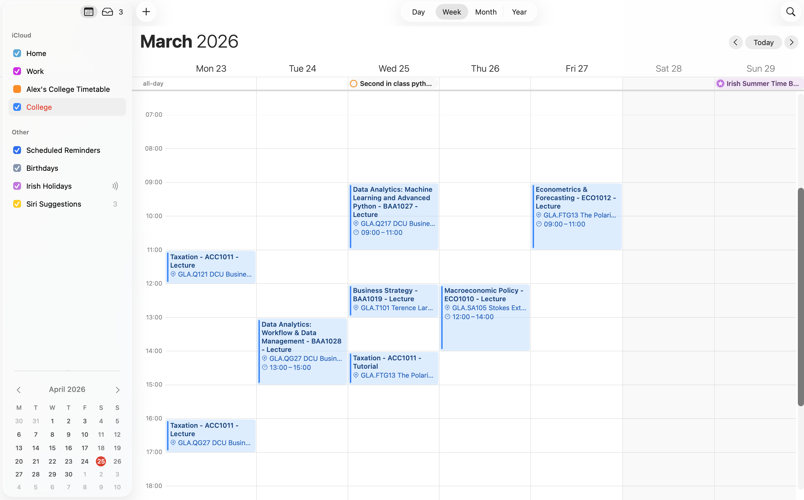

## Background

I created this project because I found the DCU timetable experience frustrating and inefficient. Each time I wanted to check my timetable, I either had to log in or manually search for/select my course and modules through the timetable website. This made something simple, checking when and where my classes were, feel unnecessarily awkward. I wanted a cleaner solution where my timetable could live directly in the calendar app I already use every day.

### Overview

This project is a Python-based timetable converter that takes selected DCU module timetable data and turns it into an importable calendar file. The script queries the DCU public timetable API over a fixed date range, retrieves the relevant timetable events, and exports them into an .ics file that can be added to Apple Calendar or any other calendar app that supports iCalendar files.

### Results

- Clean, quick and easy!
```{=html}
<a
  href="images/calendar.png"
  class="hobby-lightbox-trigger"
  data-lightbox-target="calendar-lightbox"
  aria-label="Open timetable screenshot in popout">
  
</a>
<dialog id="calendar-lightbox" class="hobby-lightbox" aria-label="Expanded timetable screenshot">
  <button type="button" class="hobby-lightbox__close" aria-label="Close image">&times;</button>
  
</dialog>
<script>
(() => {
  const trigger = document.querySelector('[data-lightbox-target="calendar-lightbox"]');
  const dialog = document.getElementById('calendar-lightbox');
  if (!trigger || !dialog) return;
  const closeBtn = dialog.querySelector('.hobby-lightbox__close');
  trigger.addEventListener('click', (event) => {
    event.preventDefault();
    if (typeof dialog.showModal === 'function') dialog.showModal();
  });
  closeBtn?.addEventListener('click', () => dialog.close());
  dialog.addEventListener('click', (event) => {
    if (event.target === dialog) dialog.close();
  });
})();
</script>
```

### Repository

```{=html}
<p>
  <a href="https://github.com/robertshaw5/dcu-college-timetable" target="_blank" rel="noopener noreferrer" aria-label="Open GitHub repository">
    
  </a>
  <a href="https://github.com/robertshaw5/dcu-college-timetable" target="_blank" rel="noopener noreferrer">Check out the repo here</a>
</p>
```

