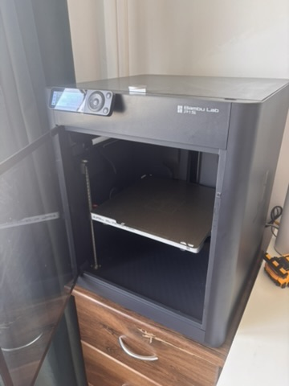
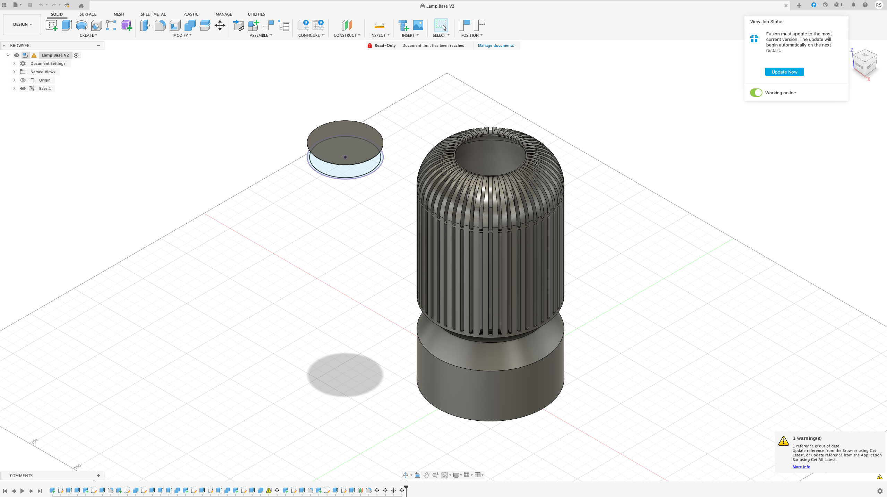
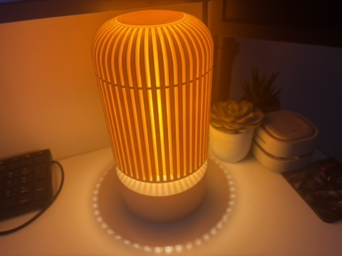
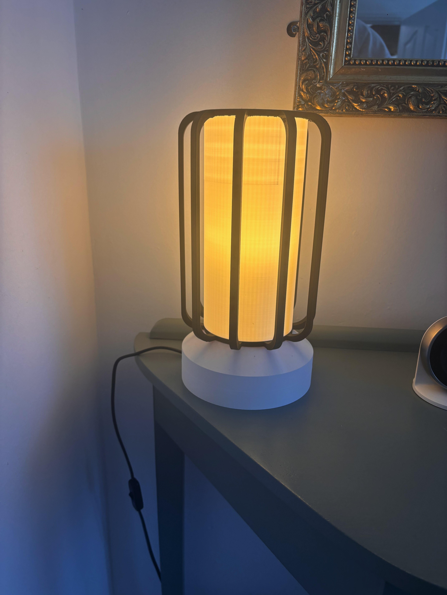
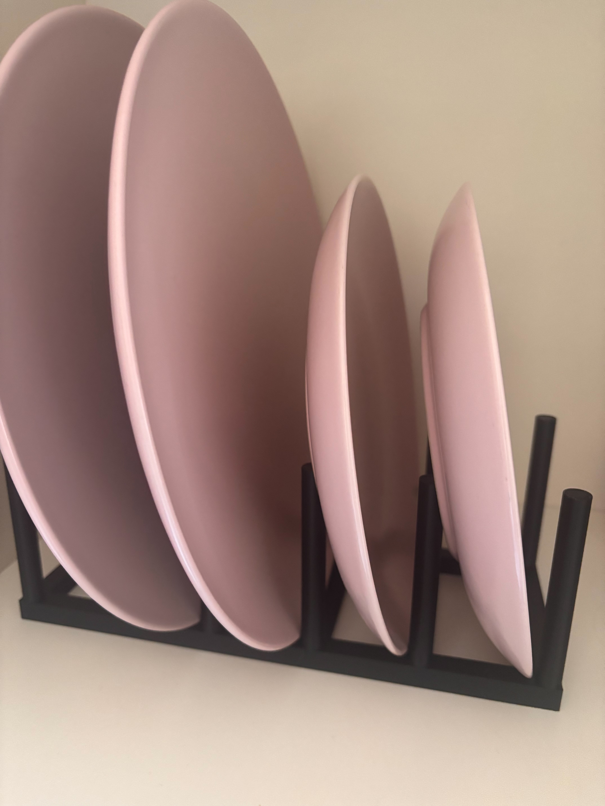
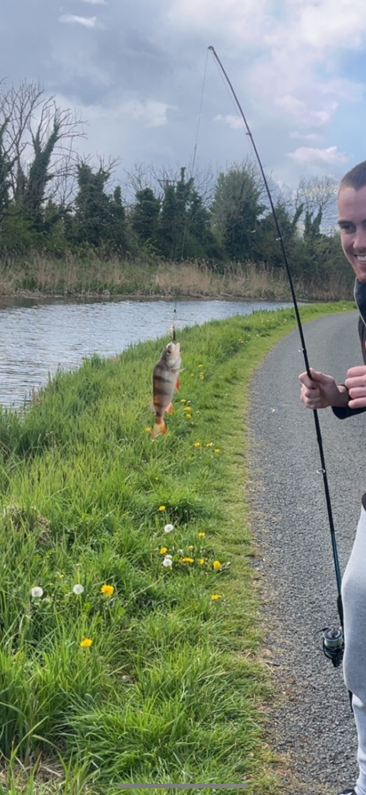

Get to know a bit more about me by taking a look at some of my hobbies and interests.

## 3D design and printing

```{=html}
<div class="hobby-intro">
  <div class="hobby-intro__text">
    <p>One of my hobbies is 3D printing. I really enjoy desinging and producing practical, custom objects using CAD software and my Bambu Labs P1S 3D printer. I like taking ideas from concept and watching them materialise into a finished product that I can hold in my hands. I taught myself how to use Fusion 360, which is a free CAD modelling software, and to use Bambu Studio's which is used to prepare prints and alter any print settings like configuring the material, layer height, supports, infills and surface finishes. What I love most about it is the problem-solving aspect. Rarely do I ever print something that I modelled just once, it typically takes a few tries to get it perfect through constant iteration.</p>
  </div>
  <a href="images/3d_printer.jpeg" class="hobby-lightbox-trigger hobby-intro__image-wrap" data-full-src="images/3d_printer.jpeg" aria-label="Open larger 3D printer image">
    
  </a>
</div>

<h3>Some of the stuff I've made</h3>

<div class="hobby-carousel" data-carousel>
  <button type="button" class="hobby-carousel__btn hobby-carousel__btn--prev" aria-label="Previous media">&#10094;</button>
  <div class="hobby-carousel__viewport">
    <div class="hobby-carousel__track">
      <div class="hobby-carousel__slide is-active">
        <video class="hobby-video" controls preload="metadata">
          <source src="videos/lampshade_timelapse.mp4" type="video/mp4">
          Your browser does not support the video tag.
        </video>
        <p class="hobby-carousel__title">Lampshade print timelapse</p>
        <p class="hobby-carousel__desc">This print took 11 and half hours. It was amongst one of the first things that I printed that I actually modelled myself. How cool is the timelapse!!</p>
      </div>
      <div class="hobby-carousel__slide">
        <a href="images/CAD_ss.png" class="hobby-lightbox-trigger" data-full-src="images/CAD_ss.png" aria-label="Open larger CAD model screenshot">
          
        </a>
        <p class="hobby-carousel__title">CAD design screenshot</p>
        <p class="hobby-carousel__desc">I taught myself how to use Fusion360, a free CAD modelling software. This is how the part looked before sending it to print.</p>
      </div>
      <div class="hobby-carousel__slide">
        <a href="images/3d_printed_lamp.jpeg" class="hobby-lightbox-trigger" data-full-src="images/3d_printed_lamp.jpeg" aria-label="Open larger finished lamp image">
          
        </a>
        <p class="hobby-carousel__title">Final 3D printed lamp</p>
        <p class="hobby-carousel__desc">The completed piece after assembly. I took the wiring compenents from an old lamp that was destined for the dump.</p>
      </div>
      <div class="hobby-carousel__slide">
        <a href="images/3d_printed_phone_dock.jpg" class="hobby-lightbox-trigger" data-full-src="images/3d_printed_phone_dock.jpg" aria-label="Open larger 3D printed phone dock image">
          
        </a>
        <p class="hobby-carousel__title">Phone dock</p>
        <p class="hobby-carousel__desc">This was a design I found online. It is a phone docking station that looks like an old school alarm clock, and supports magsafe charging for Iphones. I also added a charger for the apple watch.</p>
      </div>
      <div class="hobby-carousel__slide">
        <a href="images/3d_printed_lamp2.jpg" class="hobby-lightbox-trigger" data-full-src="images/3d_printed_lamp2.jpg" aria-label="Open larger second 3D printed lamp image">
          
        </a>
        <p class="hobby-carousel__title">Another lamp</p>
        <p class="hobby-carousel__desc">An oddly designed lamp that I modelled. This was my first time printing in with white PLA which really highlights imperfections. Again I took apart a lamp that was heading to the dump.</p>
      </div>
      <div class="hobby-carousel__slide">
        <a href="images/3d_printed_kitchen_organiser.jpg" class="hobby-lightbox-trigger" data-full-src="images/3d_printed_kitchen_organiser.jpg" aria-label="Open larger 3D printed kitchen organiser image">
          
        </a>
        <p class="hobby-carousel__title">Kitchen storage organiser</p>
        <p class="hobby-carousel__desc">One of the many storage/organiser pieces that I have printed.</p>
      </div>
      <div class="hobby-carousel__slide">
        <a href="images/3d_printed_nespresso_pod_holder.jpg" class="hobby-lightbox-trigger" data-full-src="images/3d_printed_nespresso_pod_holder.jpg" aria-label="Open larger 3D printed Nespresso pod holder image">
          
        </a>
        <p class="hobby-carousel__title">Nespresso Pod holder</p>
        <p class="hobby-carousel__desc">This is designed to fit Nespresso pod boxes and store them neatly, making the pods easily accessible. This is probably my favourite print because of how simple and easy it is.</p>
      </div>
    </div>
  </div>
  <button type="button" class="hobby-carousel__btn hobby-carousel__btn--next" aria-label="Next media">&#10095;</button>
  <div class="hobby-carousel__dots" aria-label="Media slide navigation"></div>
</div>

<dialog class="hobby-lightbox" id="hobby-lightbox">
  <button type="button" class="hobby-lightbox__close" aria-label="Close image">&times;</button>
  
</dialog>

<script>
window.addEventListener("DOMContentLoaded", () => {
  const lightbox = document.getElementById("hobby-lightbox");
  if (lightbox) {
    const lightboxImage = lightbox.querySelector(".hobby-lightbox__image");
    const closeButton = lightbox.querySelector(".hobby-lightbox__close");
    const triggers = document.querySelectorAll(".hobby-lightbox-trigger");

    triggers.forEach((trigger) => {
      trigger.addEventListener("click", (event) => {
        event.preventDefault();
        lightboxImage.src = trigger.dataset.fullSrc || trigger.getAttribute("href");
        lightboxImage.alt = trigger.querySelector("img")?.alt || "Expanded hobby image";
        lightbox.showModal();
      });
    });

    closeButton.addEventListener("click", () => lightbox.close());
    lightbox.addEventListener("click", (event) => {
      if (event.target === lightbox) lightbox.close();
    });
  }

  const carousels = document.querySelectorAll("[data-carousel]");
  carousels.forEach((carousel) => {
    const track = carousel.querySelector(".hobby-carousel__track");
    const slides = Array.from(carousel.querySelectorAll(".hobby-carousel__slide"));
    const prevBtn = carousel.querySelector(".hobby-carousel__btn--prev");
    const nextBtn = carousel.querySelector(".hobby-carousel__btn--next");
    const dotsWrap = carousel.querySelector(".hobby-carousel__dots");
    if (!track || slides.length === 0 || !prevBtn || !nextBtn || !dotsWrap) return;

    if (slides.length <= 1) {
      prevBtn.style.display = "none";
      nextBtn.style.display = "none";
      dotsWrap.style.display = "none";
    }

    let current = 0;

    const dots = slides.map((_, index) => {
      const dot = document.createElement("button");
      dot.type = "button";
      dot.className = "hobby-carousel__dot";
      dot.setAttribute("aria-label", `Go to media ${index + 1}`);
      dot.addEventListener("click", () => goTo(index));
      dotsWrap.appendChild(dot);
      return dot;
    });

    const goTo = (index) => {
      current = (index + slides.length) % slides.length;
      track.style.transform = `translateX(-${current * 100}%)`;
      slides.forEach((slide, i) => slide.classList.toggle("is-active", i === current));
      dots.forEach((dot, i) => dot.classList.toggle("is-active", i === current));
    };

    prevBtn.addEventListener("click", () => goTo(current - 1));
    nextBtn.addEventListener("click", () => goTo(current + 1));
    goTo(0);
  });
});
</script>
```

## Fishing, hiking and nature

```{=html}
<div class="hobby-split">
  <div class="hobby-carousel hobby-carousel--compact" data-carousel>
    <button type="button" class="hobby-carousel__btn hobby-carousel__btn--prev" aria-label="Previous media">&#10094;</button>
    <div class="hobby-carousel__viewport">
      <div class="hobby-carousel__track">
        <div class="hobby-carousel__slide is-active">
          <a href="images/Montenegro.jpeg" class="hobby-lightbox-trigger" data-full-src="images/Montenegro.jpeg" aria-label="Open larger Montenegro landscape image">
            
          </a>
          <p class="hobby-carousel__title">Picture from my trip to Montenegro</p>
        </div>
        <div class="hobby-carousel__slide">
          <a href="images/first_fish.jpeg" class="hobby-lightbox-trigger" data-full-src="images/first_fish.jpeg" aria-label="Open larger first fish image">
            
          </a>
          <p class="hobby-carousel__title">My first fish</p>
        </div>
        <div class="hobby-carousel__slide">
          <a href="images/niagra_falls.jpeg" class="hobby-lightbox-trigger" data-full-src="images/niagra_falls.jpeg" aria-label="Open larger Niagara Falls image">
            
          </a>
          <p class="hobby-carousel__title">Niagara Falls</p>
        </div>
      </div>
    </div>
    <button type="button" class="hobby-carousel__btn hobby-carousel__btn--next" aria-label="Next media">&#10095;</button>
    <div class="hobby-carousel__dots" aria-label="Media slide navigation"></div>
  </div>

  <div class="hobby-intro__text">
    <p>In my spare time, I am typically outdoors, whether I'm going fishing with my friends or on a hike. I like the peace that nature provides. I often hike different trails in glendalough and typically do atleast one hike or walking trail whenever I go on holiday. I recently went to montenegro which had the most naturally beautiful landscape I had ever seen.</p>
  </div>
</div>
```

## My other hobbies & interests

- I'm an avid sports fan. I've played GAA since a young age for my local club Naas. Growing up I also played rugby for Naas RFC and my school Naas CBS.
- I enjoy problem-solving with coding. I taught myself python after I finished my leaving cert and have loved it ever since. I have also used R before, although not a fan. This year I learned SQL in college. I love using these (with the help of AI!) to create cool and interesting projects.
- Sports betting. I want to preface this by saying I am **not** a gambling addict! I enjoy analysing betting markets, identifying pricing inefficiencies, and applying data-driven thinking to find value where odds may not fully reflect the underlying probabilities.