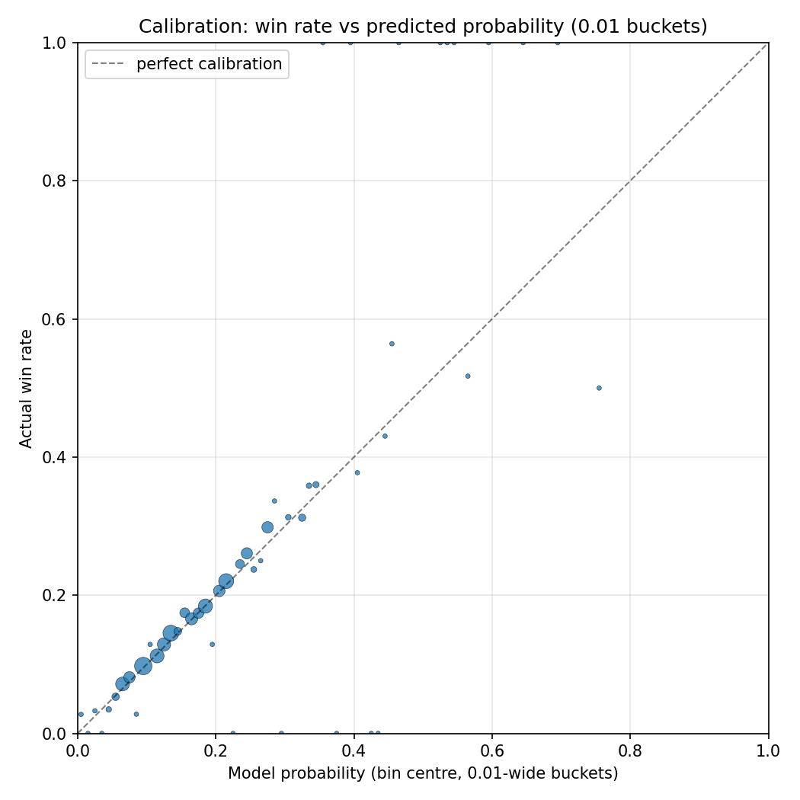
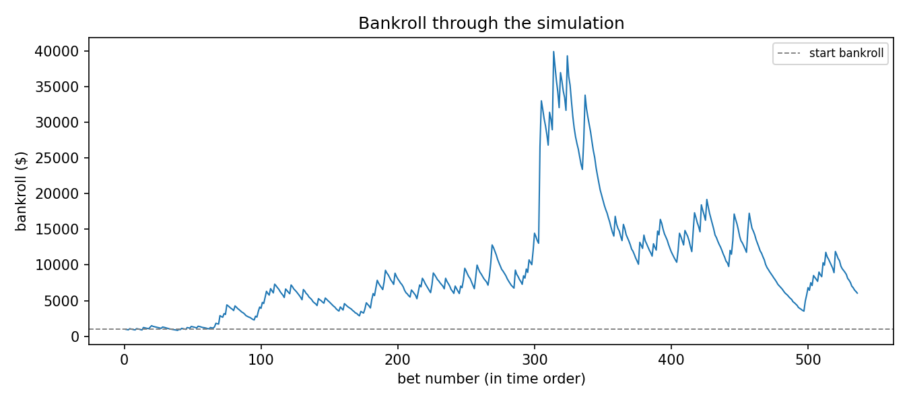

## Background

If it's not clear already, sports betting is a major interest of mine. I undertook this research as part of another data analytics module that I was enrolled in. I combined my existing interest in this area with the knowledge I gained in that module to try and answer the following research question:  
```{=html}
<p style="text-align:center;"><em>Can machine learning techniques find an edge in Irish greyhound racing win markets?</em></p>
```

### Overview

This project explored whether machine learning could be used to identify an edge in Irish greyhound racing win markets. Using historical race data collected from the Greyhound Racing Ireland website, I built a dataset covering 74,927 races between June 2020 and March 2026, including race-level data, runner-level data, and each greyhound’s historical performance information. From this, I created 62 predictive features designed to capture factors such as form, trap position, race characteristics, venue, sectional performance, and each dog’s relative strength compared with the other runners in the same race.

The aim of the project was not just to predict the most likely winner, but to estimate each runner’s true win probability and compare it against bookmaker starting prices. A LightGBM model was trained using a chronological train-validation-test split to reflect a realistic betting scenario and avoid look-ahead bias. The model’s probabilities were then calibrated using isotonic regression and normalised within each race so that all runner probabilities summed to 100%.

The results showed that the model had practical betting value under certain conditions. It achieved a top-pick accuracy of 32.91%, meaning its highest-rated runner won almost one-third of races in the test set. However, the key finding was that blindly backing every positive expected value selection was not profitable. The strongest results came when bets were restricted to selections that were both positive expected value opportunities and the model’s top-ranked runner. Under a constrained Kelly staking approach, the best-performing strategy produced 504.95% simulated bankroll growth, although the bankroll path also showed significant volatility.

Overall, the project found that machine learning can potentially identify an edge in Irish greyhound racing, but only when model probabilities are carefully calibrated, betting selections are filtered, and staking is controlled. The research also highlighted the limits of predictive modelling in betting markets, especially where late information such as greyhound weight or market movement may already be reflected in bookmaker prices.

### Results

```{=html}
<div style="display:grid;grid-template-columns:repeat(auto-fit,minmax(16rem,1fr));gap:0.9rem;max-width:56rem;">
  <figure style="margin:0;">
    <a href="images/p_win_calibration_scatter.png" class="hobby-lightbox-trigger" data-full-src="images/p_win_calibration_scatter.png" aria-label="Open larger calibration scatter plot">
      
    </a>
  </figure>
  <figure style="margin:0;">
    <a href="images/bankroll_sim.png" class="hobby-lightbox-trigger" data-full-src="images/bankroll_sim.png" aria-label="Open larger bankroll simulation chart">
      
    </a>
  </figure>
</div>

<dialog id="ml-lightbox" class="hobby-lightbox" aria-label="Expanded results image">
  <button type="button" class="hobby-lightbox__close" aria-label="Close image">&times;</button>
  
</dialog>
<script>
(() => {
  const dialog = document.getElementById("ml-lightbox");
  if (!dialog) return;
  const expandedImg = dialog.querySelector(".hobby-lightbox__image");
  const closeBtn = dialog.querySelector(".hobby-lightbox__close");
  const triggers = document.querySelectorAll('a.hobby-lightbox-trigger[data-full-src]');
  if (!expandedImg || !closeBtn || triggers.length === 0) return;

  triggers.forEach((trigger) => {
    trigger.addEventListener("click", (event) => {
      event.preventDefault();
      const fullSrc = trigger.getAttribute("data-full-src");
      const sourceImg = trigger.querySelector("img");
      if (!fullSrc || !sourceImg) return;
      expandedImg.src = fullSrc;
      expandedImg.alt = sourceImg.alt || "Expanded results image";
      if (typeof dialog.showModal === "function") dialog.showModal();
    });
  });

  closeBtn.addEventListener("click", () => dialog.close());
  dialog.addEventListener("click", (event) => {
    if (event.target === dialog) dialog.close();
  });
})();
</script>
```

### What I Learned

- How to build an end-to-end ML workflow, from scraping race data to testing a betting strategy.
- Sharpened my skills with Python libraries such as pandas and NumPy for cleaning, transforming, and analysing large datasets.
- Learned the importance of feature selection and feature engineering when building useful machine learning models.

### Research Report

View the research report here: [Machine Learning Research Project (PDF)](pdf/machine_learning_research_project.pdf)

### Repository

```{=html}
<p style="display:flex;align-items:center;gap:0.5rem;flex-wrap:wrap;">
  <a href="https://github.com/robertshaw5/machine-learning-research" target="_blank" rel="noopener noreferrer" aria-label="Open machine learning research GitHub repository" style="display:inline-flex;align-items:center;gap:0.5rem;">
    
    <span>View the repo here</span>
  </a>
</p>
```
